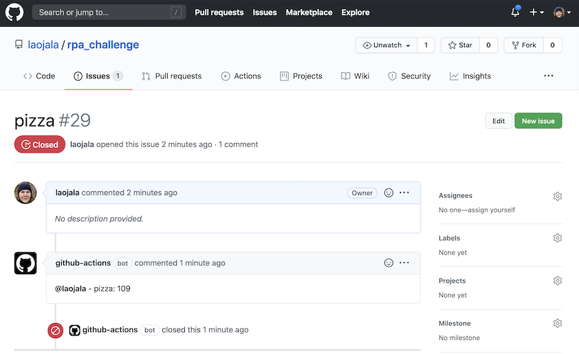

# Demo: Find number of recipes in foodie.fi website

Demo project for running Robot Framework tasks in Docker and in GitHub Workflows.

## Background

Demo is inspired by the [Mimmit Koodaa RPA summer challenge 2020](https://mimmitkoodaa.ohjelmistoebusiness.fi/blogi/rpa-summer-challenge/). Project is also a submission to a [GitHub Actions Hackathon on DEV](https://dev.to/devteam/announcing-the-github-actions-hackathon-on-dev-3ljn) as it demonstrates usage of GitHub Actions.

### Project demonstrates

1. How to run Robot Framework Tasks using Docker without need to install Python and Robot Framework to a computer
2. How to run Robot Framework Tasks in GitHub Workflow using GithubActions:
    * Automated runs for commits in the main branch and pull requests. Action can be also triggered manually (configuration:  [.github/workflows/trigger_search.yml](.github/workflows/trigger_search.yml))
    * Run Tasks when a new issue is opened. Action uses issue title to search a recipe in [foodie.fi/recipes](https://www.foodie.fi/recipes) and closes issue by commenting number of search results in a comment. **This is the wacky wildcard** submission for the  [DEV.to Hackathon](https://dev.to/devteam/announcing-the-github-actions-hackathon-on-dev-3ljn) 🍕🍝🥕.

## Run Tasks locally using Docker

### Prerequisites

1. Install [Docker Desktop](https://www.docker.com/products/docker-desktop) if not installed
2. Place tasks to a folder `tasks`
3. Create folder `reports`

### Docker command

This approach works for all Robot Framework tasks/tests that utilise libraries pre-installed to the [ppodgorsek/robot-framework Docker container](https://hub.docker.com/r/ppodgorsek/robot-framework).

To run Tasks, paste following to a Mac/Linux terminal or Windows Powershell:

```
docker run \
    -v ${PWD}/reports:/opt/robotframework/reports:Z \
    -v ${PWD}/tasks:/opt/robotframework/tests:Z \
    ppodgorsek/robot-framework:latest
```

Or to run tasks in this repository, use this command (command passes variable `RECIPE_TO_SEARCH` and mounts results file containing a number of search results out of the container):

```
docker run \
    -v ${PWD}/reports:/opt/robotframework/reports:Z \
    -v ${PWD}/tasks:/opt/robotframework/tests:Z \
    -v ${PWD}/reports/file://opt/robotframework/temp/reports/file/ \
    -e ROBOT_OPTIONS="--variable RECIPE_TO_SEARCH:pizza" \
    ppodgorsek/robot-framework:latest
```

### Run docker in GitHub Actions

[ppodgorsek/robot-framework](https://hub.docker.com/r/ppodgorsek/robot-framework) requires autenthication to be added to a docker run command: `--user $(id -u):$(id -g) \`. Authentication can be run also locally:

```
docker run \
    -v ${PWD}/reports:/opt/robotframework/reports:Z \
    -v ${PWD}/tasks:/opt/robotframework/tests:Z \
    -v ${PWD}/reports/file://opt/robotframework/temp/reports/file/ \
    -e ROBOT_OPTIONS="--variable RECIPE_TO_SEARCH:pizza" \
    --user $(id -u):$(id -g) \
    ppodgorsek/robot-framework:latest
```

## Github Actions

[Actions tab](https://github.com/laojala/rpa_challenge/actions) of this repository showcases GitHub Workflow. That runs Robot Framework task that finds recipe on foodie.fi site and prints a number of results. 

Workflows are defined in a folder [.github/workflows/](.github/workflows/).

To trigger the recipe search, [open issue to this project](https://github.com/laojala/rpa_challenge/issues) and place a recipe you want to search to a title. Then wait around one minute and when issue is closed, search results are posted as a comment.
 


## License

This project is licensed under the MIT License.

## Acknowledgments

* Docker Image used for running Robot Framewoek Tasks:
   * [https://github.com/ppodgorsek/docker-robot-framework](https://github.com/ppodgorsek/docker-robot-framework)
* Issue matching auto-closer Action that closes recipe searchs:
    * [https://github.com/marketplace/actions/issue-matching-auto-closer]([https://github.com/marketplace/actions/issue-matching-auto-closer)
    
## Related Projects

* My other GitHub Actions demo that implements CI for Robot Framework tests:
    * [https://github.com/laojala/robot_docker_demo](https://github.com/laojala/robot_docker_demo)


